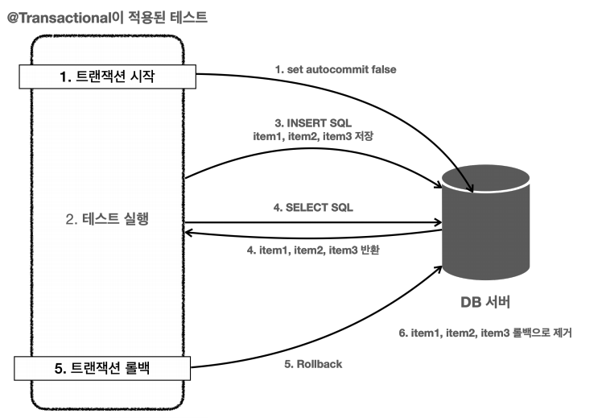

# 스프링 DB 2편 - 데이터 접근 활용 기술

## 1. 데이터 접근 기술 - 시작

### 데이터 접근 기술 진행 방식 소개

#### 적용 데이터 접근 기술
* JdbcTemplate
* MyBatis
* JPA, Hibernate
* 스프링 데이터 JPA
* Querydsl

여기에는 크게 2가지 분류가 있다.

#### SQL Mapper
* JdbcTemplate
* MyBatis

#### ORM 관련 기술
* JPA, Hibernate
* 스프링 데이터 JPA
* Querydsl

#### SQL Mapper 주요 기능
* 개발자는 SQL만 작성하면 해당 SQL의 결과를 객체로 편리하게 매핑해준다.
* JDBC를 직접 사용할 때 발생하는 여러가지 중복을 제거해주고, 기타 개발자에게 여러가지 편리한 기능을 제공한다.

#### ORM 주요 기능
* JdbcTemplate이나 MyBatis 같은 SQL 매퍼 기술은 SQL을 개발자가 직접 작성해야 하지만, 
JPA를 사용하면 기본적인 SQL은 JPA가 대신 작성하고 처리해준다.
*  개발자는 저장하고 싶은 객체를 마치 자바 컬렉션에 저장하고 조회하듯이 사용하면 ORM 기술이 데이터베이스에 해당 객체를 저장하고 조회해준다.
* JPA는 자바 진영의 ORM 표준이고, Hibernate(하이버네이트)는 JPA에서 가장 많이 사용하는 구현체이다.
* 스프링 데이터 JPA, Querydsl은 JPA를 더 편리하게 사용할 수 있게 도와주는 프로젝트이다.

### 권장하는 식별자 선택 전략
**데이터베이스 기본 키는 다음 3가지 조건을 모두 만족해야 한다.**
1. null 값은 허용하지 않는다.
2. 유일해야 한다.
3. 변해선 안 된다. 

**테이블의 기본 키를 선택하는 전략은 크게 2가지가 있다.**
* 자연 키: 비즈니스에 의미가 있는 키
* 대리 키: 비즈니스와 관련 없는 임의로 만들어진 키, 대체 키로도 불린다.

**자연 키보다는 대리 키를 권장한다.**
**비즈니스 환경은 언젠가 변한다.**

## 2. 데이터 접근 기술 - 스프링 JdbcTemplate

### JdbcTemplate 소개와 설정

#### 장점
* 설정의 편리함: 스프링으로 JDBC를 사용할 때 기본으로 사용되므로 별도의 복잡한 설정 없이 사용 가능하다.
* 반복 문제 해결: 템플릿 콜백 패턴을 사용해서 반복 작업을 대신 처리해준다.

#### 단점
* 동적 SQL을 해결하기 어렵다.

### JdbcTemplate 기능 정리

#### 주요 기능
* `JdbcTemplate`
  * 순서 기반 파라미터 바인딩을 지원한다.
* `NamedParameterJdbcTemplate`
  * 이름 기반 파라미터 바인딩을 지원한다.(권장)
* `SimpleJdbcInsert`
  * Insert SQL을 편리하게 사용할 수 있다.
* `SimpleJdbcCall`
  * 스토어드 프로시저를 편리하게 호출할 수 있다.
  * https://docs.spring.io/spring-framework/docs/current/reference/html/data-access.html#jdbcsimple-jdbc-call-1

#### JdbcTemplate 사용법 정리
자주 사용되는 기술은 아니기 때문에 사용 방법은 공식 메뉴얼을 통해 확인해보도록 하자.

https://docs.spring.io/spring-framework/docs/current/reference/html/data-access.html#jdbcJdbcTemplate

### 정리
실무에서 가장 간단하고 실용적인 방법으로 SQL을 사용하려면 JdbcTemplate을 사용하면 된다.

## 3. 데이터 접근 기술 - 테스트

### 테스트 - 데이터베이스 연동
데이터 접근 기술에 대해서 더 알아보기 전에 데이터베이스에 연동하는 테스트에 대해서 알아보자.

보통 `application.properties`를 통해 연동할 데이터베이스에 대한 설정을 할 수 있다.
```
spring.datasource.url=jdbc:h2:tcp://localhost/~/test
spring.datasource.username=sa
spring.datasource.password=
```

#### @SpringBootTest
`@SpringBootTest`는 `@SpringBootAplication`을 찾아서 설정으로 사용한다.

### 테스트 - 데이터베이스 분리
로컬에서 사용하는 애플리케이션 서버와 테스트에서 같은 데이터베이스를 사용하고 있으면 문제가 발생할 수 있다.
테스트를 다른 환경과 철저하게 분리해서 테스트 전용 데이터베이스를 별도로 운영해야 한다.

테스트에서 매우 중요한 원칙은 다음과 같다.
* 테스트는 다른 테스트와 격리해야 한다.
* 테스트는 반복해서 실행할 수 있어야 한다.

### 테스트 - 데이터 롤백

#### 트랜잭션과 롤백 전략
테스트는 반복해서 실핼할 수 있게 하는데 도움이 되는 것이 바로 트랜잭션이다.
테스트가 끝나고 나서 트랜잭션을 강제로 롤백해버리면 데이터가 깔끔하게 제거된다.

테스트는 각각의 테스트 실행 전 후로 동작하는 `@BeforeEach`, `@AfterEach`라는 편리한 기능을 제공한다.

```java
@SpringBootTest
class ItemRepositoryTest {
    @Autowired
    ItemRepository itemRepository;
    //트랜잭션 관련 코드
    @Autowired
    PlatformTransactionManager transactionManager;
    TransactionStatus status;

    @BeforeEach
    void beforeEach() {
        //트랜잭션 시작
        status = transactionManager.getTransaction(new
                DefaultTransactionDefinition());
    }

    @AfterEach
    void afterEach() {
        //MemoryItemRepository 의 경우 제한적으로 사용
        if (itemRepository instanceof MemoryItemRepository) {
            ((MemoryItemRepository) itemRepository).clearStore();
        }
        //트랜잭션 롤백
        transactionManager.rollback(status);
    }
    //...
}
```
* `PlatformTransactionManager`를 주입 받아서 사용하면 된다. 스프링 부트는 자동으로 적절한 트랜잭션 매지러를 스프링 빈으로 등록해준다.
* transactionManager.getTransaction(new DefaultTransactionDefinition()) 로 트랜잭션을 시작한다.

### 테스트 - @Transactional
`@Transactional` 애노테이션 하나로 깔끔하게 해결할 수 있다.

```java
import org.springframework.transaction.annotation.Transactional;
@Transactional
@SpringBootTest
class ItemRepositoryTest {}
```

#### @Transactional 원리
스프링이 제공하는 `@Transactional` 애노테이션은 로직이 성공적으로 수행되면 커밋하도록 동작한다.

##### @Transactional이 적용된 테스트 동작 방식


### 강제로 커밋하기 - @Commit
`@Commit`을 클래스 또는 메서드에 붙이면 테스트 종료후 롤백 대신 커밋이 호출된다.

`@Rollback(value = false)`를 사용해도 된다.

### 테스트 - 임베디드 모드 DB
테스트 케이스를 실행하기 위해서 별도의 데이터베이스를 설치하고, 운영하는 것은 상당히 번잡한 작업이다.
단순히 테스트를 검증할 용도로만 사용하기 때문에 테스트가 끝나면 데이터베이스의 데이터를 모두 삭제해도 된다.

#### 임데디드 모드
H2 데이터베이스는 자바로 개발되어 있고, JVM안에서 메모리 모드로 동작하는 특별한 기능을 제공한다. 
그래서 애플리케이션을 실행할 때 H2 데이터베이스도 해당 JVM 메모리에 포함해서 함께 실행할 수 있다.
DB를 애플리케이션에 내장해서 함께 실행한다고 해서 임베디드 모드라 한다.


#### 임베디드 모드 직정 사용
```java
@Bean
@Profile("test")
public DataSource dataSource() {
    log.info("메모리 데이터베이스 초기화");
    DriverManagerDataSource dataSource = new DriverManagerDataSource();
    dataSource.setDriverClassName("org.h2.Driver");
    dataSource.setUrl("jdbc:h2:mem:db;DB_CLOSE_DELAY=-1");
    dataSource.setUsername("sa");
    dataSource.setPassword("");
    return dataSource;
}
```

#### 스프링 부트 - 기본 SQL 스크립트를 사용해서 데이터베이스를 초기화 하는 기능
`src/test/resources/schema.sql` 또는  `src/test/resources/data.sql` 가 기본이고
위치는 `spring.sql.init.schema-locations` 또는 `spring.sql.init.data-location` 로 설정할 수 있다.

### 테스트 - 스프링 부트와 임베디드 모드
스프링 부트는 개발자에게 정말 많은 편리함을 제공하는데, 임베디드 데이터베이스에 대한 설정도 기본으로 제공한다.
**스프링 부트는 데이터베이스에 대한 별 다른 설정이 없으면 임베디드 데이터베이스를 사용한다.**


